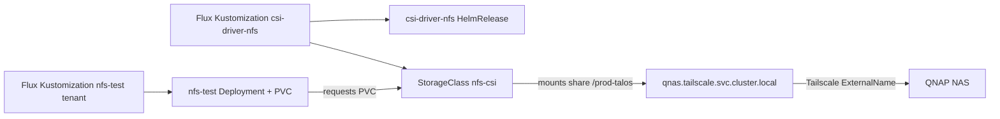

# Requirements

### Overview & Goals
Enable the QNAP NAS to be used as persistent storage for Kubernetes workloads where an S3 bucket is not applicable (i.e. for workloads that need a mounted filesystem / `PersistentVolumeClaim` rather than an S3 API). Today the QNAP is only consumed as an S3 endpoint (e.g. `infrastructure/monitoring/tempo.yaml`). The repo already contains an NFS CSI driver and an `nfs-csi` `StorageClass` targeting the NAS, but they are **not activated on any cluster**. This plan activates NFS-backed storage on the `mira8s` cluster and provides a working test deployment that mounts a PVC from the NAS.

### Scope
**In Scope**
- Activate the existing `infrastructure/csi-driver-nfs` (NFS CSI driver + `nfs-csi` StorageClass) on the `mira8s` cluster via a new Flux `Kustomization`.
- Create a new test tenant (`tenants/nfs-test`) with a `Deployment` + `PersistentVolumeClaim` using the `nfs-csi` StorageClass.
- Wire the test tenant into `mira8s` via a new Flux `Kustomization`.
- Reuse the existing StorageClass (`nfs-csi`, server `qnas.tailscale.svc.cluster.local`, share `/prod-talos`).

**Out of Scope**
- Enabling this on `cluster20` (would additionally require wiring the Tailscale infrastructure there).
- Adding a separate/general-purpose NFS share (user chose to reuse `prod-talos`).
- Migrating existing S3-based workloads (e.g. Tempo) to NFS.

### User Stories
- As a cluster operator, I want an NFS-backed `StorageClass` available on `mira8s` so that workloads that need a mounted filesystem can request a PVC backed by the QNAP NAS.
- As a developer, I want a small test deployment that mounts an NFS-backed PVC, writes to it, and survives pod restarts so that I can confirm NAS storage works before using it for real workloads.

### Functional Requirements
- After reconciliation, the `nfs-csi` `StorageClass` exists on `mira8s` and the `csi-driver-nfs` pods run in the driver namespace.
- The test deployment's PVC binds successfully against `nfs-csi` and the pod reaches `Running`.
- Data written into the mounted volume persists across pod restarts (proving the volume is backed by the NAS, not ephemeral).

### Non-Functional Requirements
- Follows the existing GitOps/Flux conventions used throughout the repo (per-cluster Flux `Kustomization` objects pointing at shared `infrastructure/` and `tenants/` paths).
- Depends on Tailscale connectivity (`qnas.tailscale.svc.cluster.local`) which is already present on `mira8s`.

# Technical Design

### Current Implementation
- **NAS as S3 today**: `infrastructure/monitoring/tempo.yaml` (lines 41-52) configures Tempo's trace backend as `s3` pointing at `qnas.pancake-vibe.ts.net:8010`, pulling credentials from the `tempo-bucket` Secret via `valuesFrom`. This is the only current NAS usage and only works for S3-aware apps.
- **NFS driver already in repo but unwired**:
  - `infrastructure/csi-driver-nfs/helm.yaml` — `HelmRepository` + `HelmRelease` for chart `csi-driver-nfs` v4.13.2 (namespace `flux-system`).
  - `infrastructure/csi-driver-nfs/storage.yaml` — `StorageClass` `nfs-csi`, provisioner `nfs.csi.k8s.io`, `server: qnas.tailscale.svc.cluster.local`, `share: /prod-talos`, `reclaimPolicy: Retain`.
  - `infrastructure/csi-driver-nfs/kustomization.yaml` — bundles both files.
  - Confirmed: no cluster references `csi-driver-nfs` (grep across `clusters/` returns nothing), so it is currently inert.
- **NAS reachability**: `infrastructure/tailscale/external-qnas.yaml` defines an `ExternalName` Service `qnas` in the `tailscale` namespace; the StorageClass resolves the NAS through `qnas.tailscale.svc.cluster.local`. Tailscale is wired on `mira8s` (`clusters/mira8s/infrastructure/tailscale.yaml`).
- **Existing consumer**: `tenants/dashboard/helm.yaml` (line 31) already references `storageClassName: nfs-csi`, but the dashboard tenant is also unwired — reinforcing that the StorageClass must first be activated.
- **Wiring pattern**: each cluster has thin Flux `Kustomization` objects (e.g. `clusters/mira8s/infrastructure/monitoring.yaml`, `clusters/mira8s/tenants/misc.yaml`) with `spec.path` pointing at a shared folder under `infrastructure/` or `tenants/`, `sourceRef` = GitRepository `flux-system`, `prune: true`. No `dependsOn` is used anywhere.

### Key Decisions
- **Use the existing NFS CSI driver + `nfs-csi` StorageClass unchanged** rather than introducing a new storage mechanism. It is the established, already-authored approach for non-S3 storage in this repo and points at the correct NAS share over Tailscale.
- **Target cluster: `mira8s`** — it already has Tailscale (required to resolve `qnas.tailscale.svc.cluster.local`) and matches the user's monitoring/Tempo cluster.
- **Test workload as a dedicated tenant `tenants/nfs-test`** following the `tenants/misc` pattern (namespace + workload + kustomization), wired via a per-cluster Flux `Kustomization`.
- **Reuse share `/prod-talos`** via the existing StorageClass; no new share/StorageClass.

### Proposed Changes
1. **Activate the NFS driver on `mira8s`** — add `clusters/mira8s/infrastructure/csi-driver-nfs.yaml`, a Flux `Kustomization` (namespace `flux-system`) with `spec.path: ./infrastructure/csi-driver-nfs`, mirroring `clusters/mira8s/infrastructure/monitoring.yaml`. This deploys both the HelmRelease and the `nfs-csi` StorageClass.
2. **Create the test tenant** under `tenants/nfs-test/`:
   - `namespace.yaml` — Namespace `nfs-test`.
   - `nfs-test.yaml` — a `PersistentVolumeClaim` (`storageClassName: nfs-csi`, `ReadWriteMany`, e.g. `1Gi`) plus a small `Deployment` (e.g. `busybox`) that mounts the PVC and writes a timestamped file in a loop to prove persistence.
   - `kustomization.yaml` — kustomize file listing `namespace.yaml` and `nfs-test.yaml` (mirrors `tenants/misc/kustomization.yaml`).
3. **Wire the test tenant** — add `clusters/mira8s/tenants/nfs-test.yaml`, a Flux `Kustomization` with `spec.path: ./tenants/nfs-test`, mirroring `clusters/mira8s/tenants/misc.yaml`.

### Data Models / Contracts
Key PVC snippet for the test tenant:
```yaml
apiVersion: v1
kind: PersistentVolumeClaim
metadata:
  name: nfs-test-pvc
  namespace: nfs-test
spec:
  accessModes: [ReadWriteMany]
  storageClassName: nfs-csi
  resources:
    requests:
      storage: 1Gi
```
The Deployment mounts this PVC at e.g. `/data` and runs a loop writing `$(date) >> /data/heartbeat.txt` to demonstrate writable, persistent NAS storage.

### File Structure
- Added: `clusters/mira8s/infrastructure/csi-driver-nfs.yaml` (Flux Kustomization activating the driver)
- Added: `tenants/nfs-test/namespace.yaml`
- Added: `tenants/nfs-test/nfs-test.yaml` (PVC + Deployment)
- Added: `tenants/nfs-test/kustomization.yaml`
- Added: `clusters/mira8s/tenants/nfs-test.yaml` (Flux Kustomization for the tenant)
- Unchanged/reused: `infrastructure/csi-driver-nfs/*`, `infrastructure/tailscale/external-qnas.yaml`

### Architecture Diagram


### Risks
- **NFS access mode support**: QNAP NFS should support `ReadWriteMany`; if only single-writer is desired, `ReadWriteOnce` also works for the single-replica test.
- **Reclaim policy `Retain`**: deleting the test PVC will leave data on the NAS; this is intentional but worth noting for cleanup.
- **Tailscale dependency**: the driver can only mount if `qnas.tailscale.svc.cluster.local` resolves; already satisfied on `mira8s`.
- **NFS mount options**: if mounts fail, may need to uncomment `mountOptions: nfsvers=4.1` in `infrastructure/csi-driver-nfs/storage.yaml` (currently commented).

# Testing

### Validation Approach
Validate through Flux reconciliation and Kubernetes object states on `mira8s`, confirming the StorageClass is present, the PVC binds, the pod runs, and data persists across restarts.

### Key Scenarios
- `StorageClass nfs-csi` exists after the `csi-driver-nfs` Flux Kustomization reconciles, and `csi-driver-nfs` controller/node pods are `Running`.
- The `nfs-test` tenant reconciles: PVC `nfs-test-pvc` transitions to `Bound` and the deployment pod reaches `Running` with the volume mounted at `/data`.
- Writing to `/data/heartbeat.txt` succeeds (verifiable via pod logs / exec listing the file).

### Edge Cases
- Pod restart / rescheduling: after deleting the pod, the new pod re-mounts the same PVC and the previously written `heartbeat.txt` content is still present (persistence proof).
- Mount failure path: if the pod stays `ContainerCreating` with NFS mount errors, confirm Tailscale resolution of `qnas.tailscale.svc.cluster.local` and consider enabling `nfsvers=4.1` mount options.

### Test Changes
No automated tests exist in this GitOps repo; validation is manifest/reconciliation-based. The `nfs-test` deployment itself acts as the functional smoke test for NAS-backed storage.

# Delivery Steps

### ✓ Step 1: Activate the NFS CSI driver and StorageClass on mira8s
The existing NFS CSI driver and `nfs-csi` StorageClass become active on the mira8s cluster, making NAS-backed persistent storage available.

- Add `clusters/mira8s/infrastructure/csi-driver-nfs.yaml` as a Flux `Kustomization` (namespace `flux-system`), modeled on `clusters/mira8s/infrastructure/monitoring.yaml`.
- Set `spec.path: ./infrastructure/csi-driver-nfs`, `sourceRef` to GitRepository `flux-system`, `prune: true`, and `wait: true`.
- This reconciles the existing `infrastructure/csi-driver-nfs/helm.yaml` (HelmRelease + HelmRepository) and `infrastructure/csi-driver-nfs/storage.yaml` (StorageClass `nfs-csi`, server `qnas.tailscale.svc.cluster.local`, share `/prod-talos`) with no changes to those files.

### ✓ Step 2: Create the nfs-test tenant with a PVC-backed test deployment
A new `nfs-test` tenant provides a working example that mounts an NFS-backed PVC from the NAS and proves data persistence.

- Add `tenants/nfs-test/namespace.yaml` defining Namespace `nfs-test` (mirrors `tenants/misc/namespace.yaml`).
- Add `tenants/nfs-test/nfs-test.yaml` containing a `PersistentVolumeClaim` (`storageClassName: nfs-csi`, `ReadWriteMany`, `1Gi`) and a single-replica `busybox` `Deployment` that mounts the PVC at `/data` and appends timestamps to `/data/heartbeat.txt` in a loop.
- Add `tenants/nfs-test/kustomization.yaml` listing `namespace.yaml` and `nfs-test.yaml` (mirrors `tenants/misc/kustomization.yaml`).

### ✓ Step 3: Wire the nfs-test tenant into the mira8s cluster
Flux deploys the test tenant on mira8s, completing the end-to-end NAS storage example.

- Add `clusters/mira8s/tenants/nfs-test.yaml` as a Flux `Kustomization` (namespace `flux-system`), modeled on `clusters/mira8s/tenants/misc.yaml`.
- Set `spec.path: ./tenants/nfs-test`, `sourceRef` to GitRepository `flux-system`, `prune: true`.
- Document the validation steps (StorageClass present, PVC `Bound`, pod `Running`, and `heartbeat.txt` surviving a pod restart) as the smoke test for NAS-backed storage.